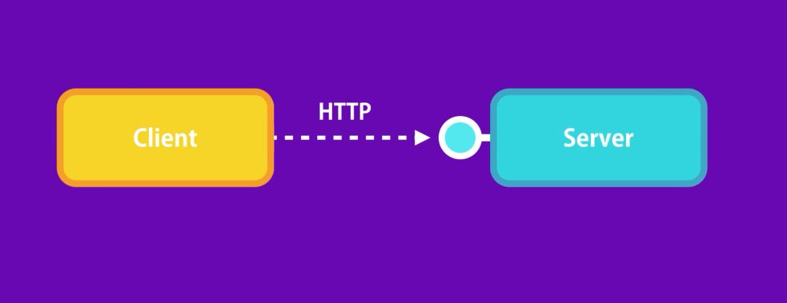
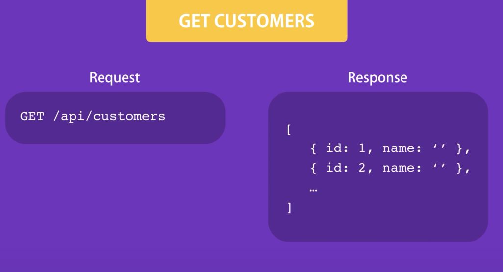
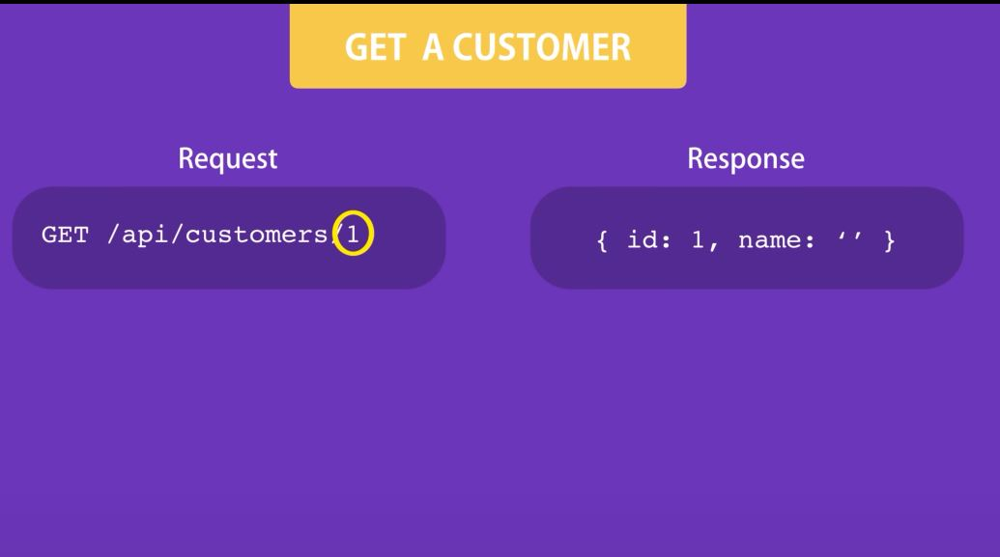
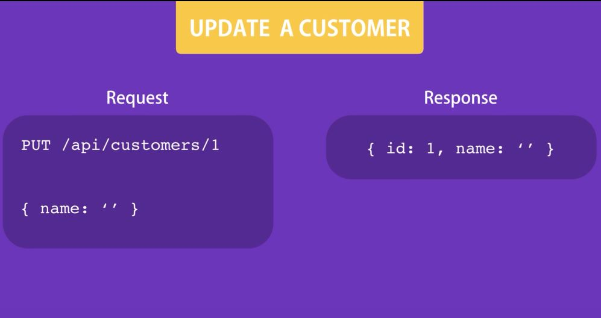
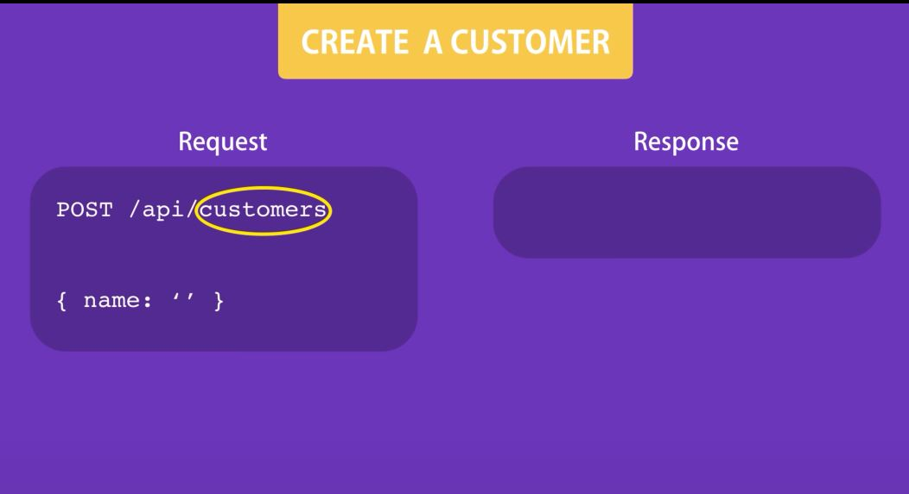

REST - Representational State Trasfer



* the client to server and server to client communication using http method such as **GET POST PUT DELETE** is called REST.
*  We use http protocol to support to **CREATE READ UPDATE DELETE** DATA (CRUD).

* example of a end point :  http://vidly.com/api/customers 
## GET request:


* this an example of sending an http request to a server to get information of customers from the server database.



* when we want information on a specific customer we include the unque id for the customer here in the image it is 1.

## PUT/update request



* this is an example of a put request send to server to update a customer. As seen on the image the customer object and id is also included on the request that been send to server.

## DELETE request


* this is anm example of a delete request as seen in the image the request needs th id.

## POST requst




* this is an example of a POST request used for the operation create and this need the customer object to execute and create the database.

## [EXPRESS.JS](http://expressjs.com/) 

**npm i express** in terminal

* to call express in our app.js folder- we have to requie the express in a variable,

````
const express = require('express');

const app = express();

<!-- express comes with many feature these are some we mainly use -->
app.get();
app.post();
app.put();
app.delete();
````

